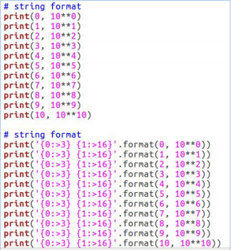
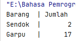
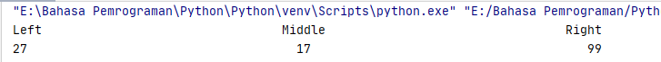
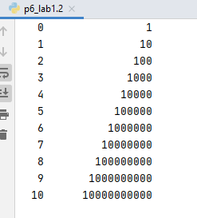

# Tugas Pertemuan ke 5 & 6 - Bahasa Pemrograman
Perkenalkan nama saya yang sering akrab di panggil Uci, disini saya membuat repository ini untuk memenuhi Tugas Pertemuan ke 5 & 6 bahasa Pemrograman.<br><br>

Nama    : Siti Nur Fauziah<br>
NIM     : 312010032<br>
Kelas   : TI.20.B1<br>

#### DAFTAR ISI<br>
| No | Description | Link|
| ----- | ----- | ----- |
| 1 | Tugas Pertemuan 5 | [Click Here](#tugas-pertemuan-5) |
| 2 | Tugas Pertemuan 6 - Lab 1 | [Click Here](#2-tugas-pertemuan-6---lab-1) |
| 3 | Tugas Pertemuan 6 - Lab 2 | [Click Here](#3-pertemuan-6---lab-2) |
| 4 | Tugas Pertemuan 6 - Lab 1-2 | [Click Here](#4-tugas-pertemuan-6---lab-1-2) |

## 1. Tugas Pertemuan 5
Pertama saya akan menjelaskan Tugas Pertemuan ke 5 yaitu Membuat Program untuk menginputkan biodata yang terdiri dari Nama lengkap, Nickname, NPM, TTL, No Telp, dan Alamat :
<br>
Berikut <i>source code</i> yang telah diberikan oleh Dosen saya atau klik link berikut ([Tugas 5 Python](p5_tugas.py))
```python
print("Please enter your Full name : ")
fullname=input()
print("Please enter your Nickname : ")
nickname=input()
print("Please insert your NPM : ")
npm=int(input())
print("Please enter your Born place : ")
bornplace=input()
print("Please insert your Age : ")
age=int(input())
print("Please enter your Home address : ")
address=input()
print("Please enter your Phone number : ")
phonenumber=int(input())


print("\nAssalamualaikum Wr, Wb.")
print(f"Let me introduce my self.My name is {fullname}, but you can call me {nickname}.My NPM's {NPM}.I was born in {bornplace} and i am {age} years old. I am very glad if you want to invite my house in {address}.So, don't forget to call me before with the number {phonenumber}.")
print("\nThank you.")
```

Berikut untuk penjelasannya : <br>
```python
print("Please enter your Full name : ")
fullname=input()
```
* Source code di atas berfungsi untuk mencetak hasil / output berupa string " Please enter your full name : ", dan secara otomatis kita akan bisa mengisi / input nama kita.Seperti gambar di bawah ini <br>
<br>
* Syntax atau perintah <i>fullname=input()</i> seperti di atas tadi adalah source code untuk membuat inputan/variable.<br>
Maksud Variable disini adalah tempat menyimpan data, dan lokasi di memori yang digunakan untuk menyimpan nilai, sedangkan tipe data adalah jenis data yang tersimpan dalam variable.Variable bersifat <i>mutable</i> artinya nilainya bisa berubah-ubah.Yang berfungsi sebagai variable dalam source code diatas adalah fullname.<br><br>
> Untuk menampilkan output berupa integer atau angka kita tidak perlu menambahkan tanda petik dua ("input") di dalam kurung jadi kita bisa langsung saja untuk menginputkan angkanya.<br>
```python
print(270799)
```
* Maka hasilnya akan otomatis keluar angka yang kita inputkan tadi seperti di bawah ini. <br>
<br><br>
> Namun untuk syntax output angka dalam program ini kita hanya perlu menambahkan kata <i>int</i> sebelum kata input seperti di bawah ini. <br>
```python
print("Please insert your NPM : ")
npm=int(input())
```
* Hasil untuk mengisi inputan akan seperti ini :<br>
<br>

* Langkah selanjutnya untuk menghasilkan output / mengisi inputan yang lainnya seperti Nickname, Born Place, Home Address, bisa mengikuti source code/syntax pengisian Fullname, sedangkan untuk Age, dan Phone Number bisa mengikuti syntax untuk penginputan NPM.<br>
> Lalu untuk syntax/source code :<br>
```python
print("\nAssalamualaikum Wr, Wb.")
```
* Fungsi <i>\n</i> pada syntax di atas adalah untuk memberi baris baru/enter/lebih sering dikenal newline.<br>
* Sedangkan fungsi <i>print("...")</i> seperti yang sudah dibahas di atas, hasil dari syntax terserbut seperti di bawah ini.<br>
<br>
> Yang terakhir untuk menampilkan semua hasil dari inputan di atas yaitu dengan mengetikkan syntax seperti di bawah<br>
 ```python
print(f"Let me introduce my self.My name is {fullname}, but you can call me {nickname}.My NPM's {npm}.I was born in {bornplace} and i am {age} years old. I am very glad if you want to invite my house in {address}.So, don't forget to call me before with the number {phonenumber}.")
```
* Fungsi <i>f</i> pada syntax di atas adalah agar bisa memudahkan programmer dalam mencetak statement dalam satu baris dibandingkan dengan metode yang lama yaitu memisahkan string dan variable dengan simbol koma ( , ) atau plus ( + ).<br>
* Sedangkan fungsi {} pada output tersebut adalah untuk menampilkan hasil dari variable.<br>
Hasil dari output tersebut seperti berikut :<br>
<br>
<br>
<hr>
<br>

## 2. Tugas Pertemuan 6 - Lab 1
Selanjutnya yang kedua saya akan menjelaskan tugas pertemuan ke 6 yaitu tentang mempelajari <b>Operator pada Python</b>.<br>
<br>
Berikut <i>source code</i> yang telah diberikan oleh Dosen saya atau klik link berikut ([Tugas 6 - Lab 1](lab1.py))
```python
#penggunaan end
print('A', end='')
print('B', end='')
print('C', end='')
print()
print('X')
print('Y')
print('z')

#penggunaan separator
w, x, y, z = 10, 15, 20, 25
print(w, x, y, z)
print(w, x, y, z, sep=',')
print(w, x, y, z, sep='')
print(w, x, y, z, sep=':')
print(w, x, y, z, sep='-----')
```

Berikut untuk penjelasannya : <br>
* Penggunaan <i>end</i> digunakan untuk menambahkan karakter yang dicetak di akhir baris, atau lebih sering kita kenal dengan istilah <i>ganti baris</i>.Seperti contoh di bawah ini.<br>
```python
print('A', end='')
print('B', end='')
print('C', end='')
print()
print('X')
print('Y')
print('z')
```
> Hasilnya akan seperti ini.<br>
<br>

* Untuk penggunaan <i>separator</i> digunakan untuk pemisah, atau fungsinya sebagai perintah pemisah antar objek yang di cetak.Seperti contoh di bawah ini.<br>
```python
w, x, y, z = 10, 15, 20, 25
print(w, x, y, z)
print(w, x, y, z, sep=',')
print(w, x, y, z, sep='')
print(w, x, y, z, sep=':')
print(w, x, y, z, sep='-----')
```
> Hasilnya akan seperti ini.<br>
<br>
<br>
<hr>
<br>

## 3. Pertemuan 6 - Lab 2
Untuk tugas Pertemuan ke 6 - Lab 2 saya akan menjelaskan tentang <i>Konversi Nilai Variable</i>.<br>
<br>
Berikut <i>source code</i> yang telah diberikan oleh Dosen saya atau klik link berikut ([Tugas 6 - Lab 2](p6_lab2.py))
```python
a=input("masukkan nilai a:")
b=input("masukkan nilai b:")
print("variable a=",a)
print("variable b=",b)
print("hasil penggabungan {1}&{0}=%d".format(a,b) %(a+b))

#konversi nilai variable
a=int(a)
b=int(b)
print("hasil pejumlahan {1}+{0}=%d".format(a,b) %(a+b))
print("hasil pembagian {1}/{0}=%d".format(a,b) %(a/b))
```
Namun setelah saya jalankan source code tersebut terjadi <i>TypeError</i> seperti gambar di bawah ini :<br>
<br>
Lebih tepatnya terdapat eror pada file python yang kita buat, di baris ke 5 / line 5, yaitu <i>print("hasil penggabungan {1}&{0}=%d".format(a,b) %(a+b)),%d format: a number is required, not str </i>, hal ini disebabkan karena pada variable a tipe datanya <i>string</i>, sedangkan yang dibaca oleh system adalah <i>integer/numbering</i>.<br>

Cara untuk memperbaiki error tersebut saya akan jelaskan seperti di bawah ini.<br>
* Pertama kita lihat pada baris ke 5 (dinotifikasi terbaca bahwa error terletak pada baris ke 5), yaitu pada pemformatan <b>.format()</b> adalah interger, Sedangkan jika berupa string maka akan ada tanda petik dua ("..") pada pemformatan <b>.format()</b><br>
* Kedua kita akan terfokus pada variable a dan b.<br>
Pada line 1 tertulis syntax : a=input("Masukkan Nilai A : ")<br>
Sedangkan pada line 2 tertulis sytax : b=input("Masukkan Nilai B : ")<br>
> Untuk membuat inputan berupa integer/angka harus ditambahkan tipe data <i>int()</i> pada format <input()</i>. Yang seharusnya diketik adalah :
```python
a=int(input("masukkan nilai a:"))
b=int(input("masukkan nilai b:"))
```
Atau kita ketikkan ulang semua source code yang di atas sebelumnya dengan menambahkan tipe data interger.<br>
```python
a=int(input("masukkan nilai a:"))
b=int(input("masukkan nilai b:"))
print("variable a=",a)
print("variable b=",b)
print("hasil penggabungan {1}&{0}=%d".format(a,b) %(a+b))

#konversi nilai variable
a=int(a)
b=int(b)
print("hasil pejumlahan {1}+{0}=%d".format(a,b) %(a+b))
print("hasil pembagian {1}/{0}=%d".format(a,b) %(a/b))
```
Maka setelah kita jalan kan semua syntax/source code tadi akan menghasilkan seperti ini :

<br>
<hr>
<br>

## 4. Tugas Pertemuan 6 - Lab 1-2
Terakhir untuk tugas pertemuan 6 ini saya akan menjelaskan tentang <i>String Format</i>.String formatting atau pemformatan string memungkinkan kita menyuntikkan item kedalm string daripada kita mencoba menggabungkan string menggunakan koma atau string concatenation.<br>
<br>
Berikut <i>source code</i> yang telah diberikan oleh Dosen saya atau klik link berikut ([Tugas 6 - Lab 1-2](p6_lab1.2.py))
```python
#string format
print(0, 10**0)
print(1, 10**1)
print(2, 10**2)
print(3, 10**3)
print(4, 10**4)
print(5, 10**5)
print(6, 10**5)
print(8, 10**8)
print(9, 10**9)
print(10, 10**10)

#string format
print('{0:>3} {1:>16}'.format(0, 10**0))
print('{0:>3} {1:>16}'.format(1, 10**1))
print('{0:>3} {1:>16}'.format(2, 10**2))
print('{0:>3} {1:>16}'.format(3, 10**3))
print('{0:>3} {1:>16}'.format(4, 10**4))
print('{0:>3} {1:>16}'.format(5, 10**5))
print('{0:>3} {1:>16}'.format(6, 10**6))
print('{0:>3} {1:>16}'.format(7, 10**7))
print('{0:>3} {1:>16}'.format(8, 10**8))
print('{0:>3} {1:>16}'.format(9, 10**9))
print('{0:>3} {1:>16}'.format(10, 10**10))
```
Berikut untuk penjelasannya :<br>
> String Format 1
* Pada syntax / source code string format 1 akan menampilkan output berupa 2 outputan.
Yang pertama (sebelah kiri) akan menampilkan angka Urut dari angka 0 hingga angka 10, sedangkan untuk sebelah kanan akan menampilkan Operasi Aritmatika Pangkat.
Dengan ketentuan sebagai berikut, operasi pangkat dengan angka kiri sebagai pokok (Rumus : ** [bintang dua] )
Hasil dari syntax tersebut adalah 10 pangkat 0, hingga 10 pangkat 10. dengan output sebagai berikut :
1[Tugas 6](Foto/string1.PNG)<br>
> String Format 2
* Pada syntax atau source code string format 2 akan menampilkan output berupa 2 output'an juga (seperti String Format 1, yaitu kanan dan kiri).Dengan ketentuan <i>Alignment, padding, dan precesion dengan .format() dalam kurung kurawal kita dapat menetapkan panjang bidang, rata kanan/kiri, parameter pembulatan dan banyak lagi</i>.Contoh lain sebagai berikut :
```python
print('{0:7} | {2:7}'.format('Barang','QTY'))
print('{0:7} | {2:7}'.format('Sendok','2'))
print('{0:7} | {2:7}'.format('Garpu','17'))
```
Hasil dari source code di atas adalah :
<br>

Kita juga dapat menggunakan opsi opsional <, ^, atau > untuk mengatur perataan kiri, tengah, atau kanan. Contoh lain dalam penggunaan .format() sebagai berikut :
```python
print('{:<27}{:^27}{:>27}'.format('Left','Middle','Right'))
print('{:<27}{:^27}{:>27}'.format(27,07,99))
```
Hasil dari source code di atas adalah :
<br>

* Sedangkan untuk hasil String Format 2 sesuai dengan tugas yang sudah diberikan oleh Dosen saya adalah seperti di bawah ini :
<br>

Demikian penjelasan yang bisa saya sampaikan pada Tugas Pertemuan 5 & 6 yang sudah Dosen saya berikan, semoga dari penjelasan di atas dapat berguna bagi kawan - kawan yang kebetulan mungkin ada tugas yang sama, dan tentunya semua syntax/source code di atas bisa di implementasikan.
Mohon maaf apabila ada salah ketik, atau ada penjelasan yang kurang di mengerti.

Terimakasih :)
 
<hr>
<br>
