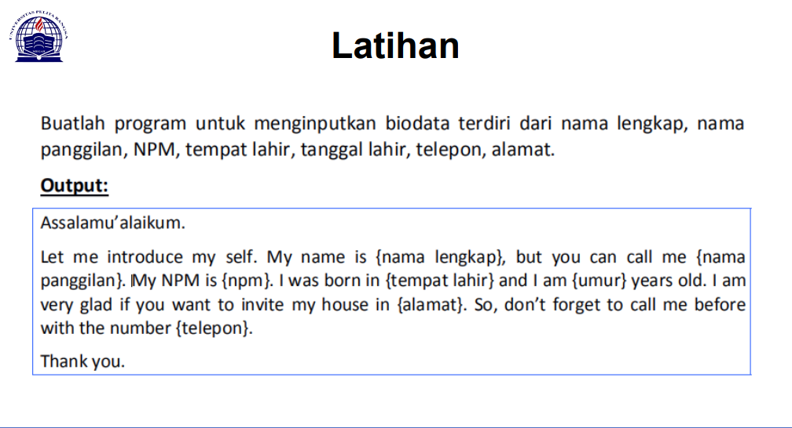
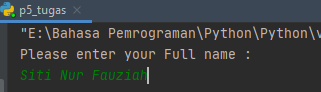
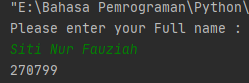
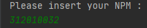
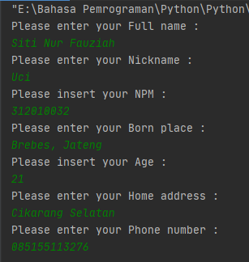
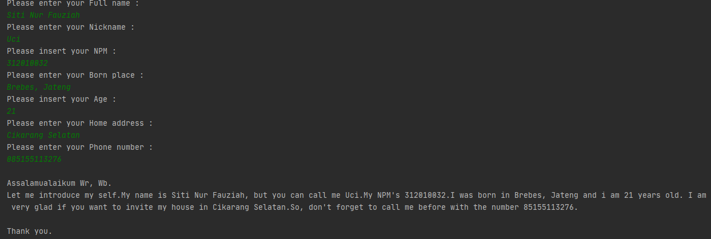

# Tugas Pertemuan ke 5 & 6 - Bahasa Pemrograman
Repository ini dibuat untuk memenuhi tugas pertemuan 5 & 6 <br><br>
Nama    : Siti Nur Fauziah<br>
NIM     : 312010032<br>
Kelas   : TI.20.B1<br>

#### DAFTAR ISI<br>
| No | Description | Link|
| ----- | ----- | ----- |
| 1 | Tugas Pertemuan 5 | [Click Here](#tugas-pertemuan-5) |
| 2 | Tugas Pertemuan 6 | [Click Here] |

## Tugas Pertemuan 5
Pertama saya akan menjelaskan Tugas Pertemuan ke 5 yaitu Membuat Program untuk menginputkan biodata yang terdiri dari Nama lengkap, Nickname, NPM, TTL, No Telp, dan Alamat :
<br>
Berikut <i>source codenya</i> atau klik link berikut ([Tugas 5 Python](p5_tugas.py))
```python
print("Please enter your Full name : ")
fullname=input()
print("Please enter your Nickname : ")
nickname=input()
print("Please insert your NPM : ")
npm=int(input())
print("Please enter your Born place : ")
bornplace=input()
print("Please insert your Age : ")
age=int(input())
print("Please enter your Home address : ")
address=input()
print("Please enter your Phone number : ")
phonenumber=int(input())


print("\nAssalamualaikum Wr, Wb.")
print(f"Let me introduce my self.My name is {fullname}, but you can call me {nickname}.My NPM's {NPM}.I was born in {bornplace} and i am {age} years old. I am very glad if you want to invite my house in {address}.So, don't forget to call me before with the number {phonenumber}.")
print("\nThank you.")
```

Berikut untuk penjelasannya : <br>
```python
print("Please enter your Full name : ")
fullname=input()
```
* Source code di atas berfungsi untuk mencetak hasil / output berupa string " Please enter your full name : ", dan secara otomatis kita akan bisa mengisi / input nama kita.Seperti gambar di bawah ini <br>
<br>
* Syntax atau perintah <i>fullname=input()</i> seperti di atas tadi adalah source code untuk membuat inputan/variable.<br>
Maksud Variable disini adalah sebuah wadah penyimpanan data pada program yang akan digunakan selama program itu berjalan. Yang berfungsi sebagai variable dalam source code diatas adalah fullname, atau lebih praktisnya kita sebut saja sebagai rumus untuk mengisi inputan dari source code <i>"Please enter your name :"</i><br><br>
* Sedangkan untuk menampilkan output berupa integer atau angka kita tidak perlu menambahkan tanda petik dua ("input") di dalam kurung jadi kita bisa langsung saja untuk menginputkan angkanya.<br>
```python
print(270799)
```
* Maka hasilnya akan otomatis keluar angka yang kita inputkan tadi seperti di bawah ini. <br>
<br><br>
* Namun untuk syntax output angka dalam program ini kita hanya perlu menambahkan kata <i>int</i> sebelum kata input seperti di bawah ini. <br>
```python
print("Please insert your NPM : ")
npm=int(input())
```
* Hasil untuk mengisi inputan akan seperti ini :<br>
<br>

* Langkah selanjutnya untuk menghasilkan output / mengisi inputan yang lainnya seperti Nickname, Born Place, Home Address, bisa mengikuti source code/syntax pengisian Fullname, sedangkan untuk Age, dan Phone Number bisa mengikuti syntax untuk penginputan NPM.<br>
* Lalu untuk syntax/source code<br>
```python
print("\nAssalamualaikum Wr, Wb.")
```
* Fungsi <i>\n</i> pada syntax di atas adalah untuk memberi baris baru/enter/lebih sering dikenal newline.<br>
* Sedangkan fungsi <i>print("...")</i> seperti yang sudah dibahas di atas, hasil dari syntax terserbut seperti di bawah ini.<br>
<br>
* Yang terakhir untuk menampilkan semua hasil dari inputan di atas yaitu dengan mengetikkan syntax seperti di bawah<br>
 ```python
print(f"Let me introduce my self.My name is {fullname}, but you can call me {nickname}.My NPM's {npm}.I was born in {bornplace} and i am {age} years old. I am very glad if you want to invite my house in {address}.So, don't forget to call me before with the number {phonenumber}.")
```
* Fungsi <i>f</i> pada syntax di atas adalah agar bisa memudahkan programmer dalam mencetak statement dalam satu baris dibandingkan dengan metode yang lama yaitu memisahkan string dan variable dengan simbol koma ( , ) atau plus ( + ).<br>
* Sedangkan fungsi {} pada output tersebut adalah untuk menampilkan hasil dari variable.<br>
Hasil dari output tersebut seperti berikut :<br>
<br>